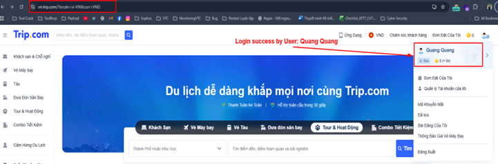
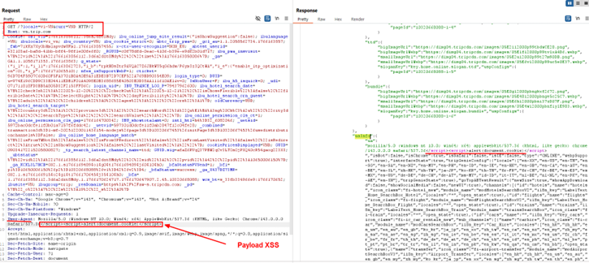
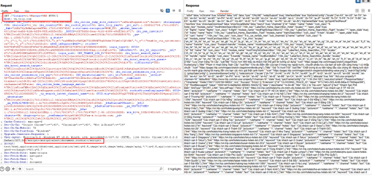

# Reflected-XSS-in-TRIP-com

Reflected XSS in User-Agent on https://vn.trip.com/
I.	  Summary
-	The application reflects the User-Agent HTTP header directly into the HTML response without proper sanitization, allowing an attacker to execute arbitrary JavaScript in the victim’s browser. 
II.	Affected Endpoint
-	GET https://vn.trip.com/?locale=vi-VN&curr=VND
III.	Steps to Reproduce
1.	Send an HTTP request to the following endpoint with a malicious payload  appended to the end of the existing User-Agent value:
2.	GET /?locale=vi-VN&curr=VND HTTP/2
3.	Host: vn.trip.com
4.	User-Agent: Mozilla/5.0 (Windows NT 10.0; Win64; x64) </script>
5.	Open the response in a browser.
6.	Observe that a JavaScript alert is executed, confirming reflected XSS.
   
IV.	Proof of Concept
-	Payload: </script>
-	Login in https://vn.trip.com/?locale=vi-VN&curr=VND
  
-	Reload the page and modify the request in the browser in URL: https://vn.trip.com/?locale=vi-VN&curr=VND in BurpSuite Intercept On
  
 	

-	Observe that the JavaScript payload is executed and an alert dialog is displayed in browser
  
  
 
 
